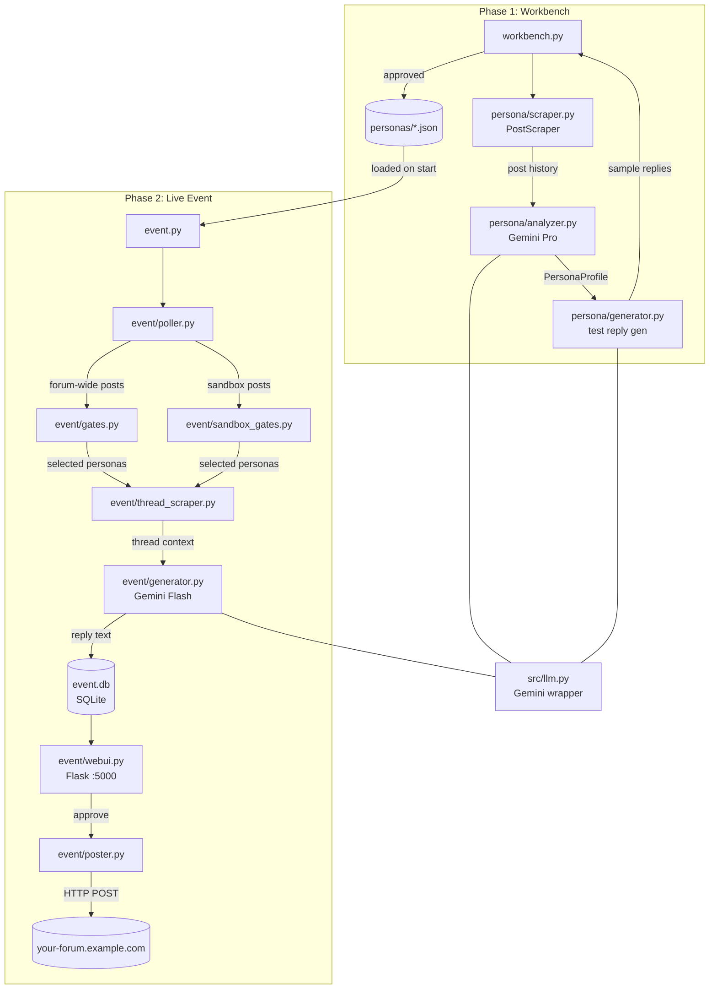
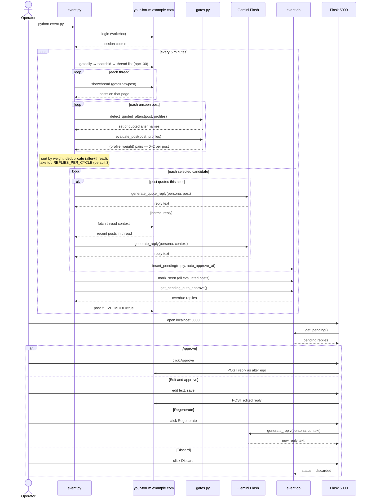
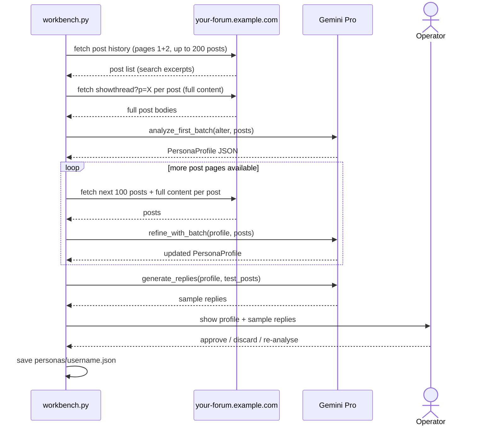
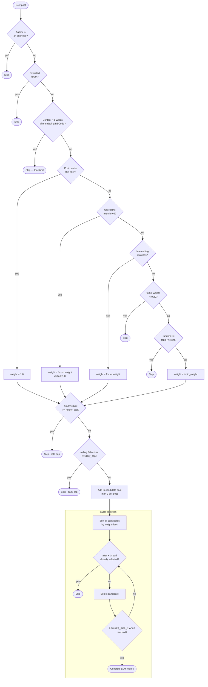

# Forum Community Simulator

A 24-hour AI experiment on [your-forum.example.com](https://your-forum.example.com) — for forum built on VBulletin 3.7.

The 27 most historically active members who have been inactive for 2+ years are **resurrected as AI alter egos**. Each alter ego gets a reversed username, a mirror-flipped avatar, and a persona built from their actual post history. During the event they respond live to forum activity — as those members would have.

---

## How it works

The project runs in two phases.

### Phase 1 — Persona Workbench (before the event)

Scrapes each inactive member's post history, feeds it to Gemini Pro, and builds a `PersonaProfile` capturing their writing style, dialect, topic interests, and personality. You review each profile interactively and approve or discard it.

### Phase 2 — Live Event (during the 24h window)

Runs in one of two mutually exclusive modes set by `SANDBOX_THREAD_IDS`:

**Forum-wide mode (default):** Polls the forum every 5 minutes for new posts. A gate layer decides which alter egos should respond (based on topic relevance, rate limits, and direct mentions). Gemini Flash generates a reply in that persona's voice. The reply lands in a local review queue where you approve, edit, discard, or regenerate it before it goes live.

**Sandbox mode (`SANDBOX_THREAD_IDS=...`):** Watches a fixed set of threads instead of the whole forum. Any user can interact directly with the alter egos in those threads. Mentioning a bot by name (or quoting them with VBulletin's quote tag) triggers that specific bot; if no bot is mentioned, a random selection responds.

---

## Architecture



---

## Sequence diagram — live event loop

> This diagram depicts **forum-wide mode**. In sandbox mode `getdaily` is replaced by direct per-thread fetches and gate evaluation uses `sandbox_gates.py` instead of `gates.py`; the review queue and auto-approve flow are identical.



---

## Workbench sequence — building a persona



---

## Setup

### Prerequisites

- Python 3.11+
- A Google Gemini API key ([Google AI Studio](https://aistudio.google.com/))
- Forum credentials for the scanning account (`wokebot`)
- Separate credentials for each alter ego account (all share one password via `ALTER_PASSWORD`)

### Install

```bash
pip install -r requirements.txt
```

### Configure

Copy `.env.example` to `.env` and fill in the values:

```env
GOOGLE_API_KEY=your_gemini_key
FORUM_USERNAME=wokebot
FORUM_PASSWORD=wokebot123
ALTER_PASSWORD=shared_password_for_alter_egos
FORUM_URL=https://your.forum.url

# Optional
LIVE_MODE=false          # true = actually post; false = simulate only
LOOKBACK_HOURS=48        # ignore posts older than this on startup
POLL_INTERVAL=300        # seconds between forum polls
SEARCH_DELAY=6           # seconds between post-history requests (forum rate limit)
AUTO_APPROVE_MINUTES=10  # minutes before a queued reply auto-approves
REPLIES_PER_CYCLE=3      # max LLM replies generated per poll cycle (forum-wide mode)
SANDBOX_THREAD_IDS=      # comma-separated thread IDs; if set, activates sandbox mode
SANDBOX_REPLIES_PER_POST=3  # max random bot replies per unmentioned post (sandbox mode)
```

---

## Running

### Phase 1 — Build personas

```bash
python workbench.py
```

Processes each account in `config/approved_accounts.json` interactively. Approved personas are saved to `personas/{username}.json`. Re-run as many times as needed — it picks up where it left off.

At the main list, type `b` to run a bulk initial analysis for all unstarted personas automatically.

Inside each persona, the actions are independent:

| Key | Action |
|-----|--------|
| `l` | Load next page (~100 posts) and refine the profile |
| `s` | Generate sample replies on demand |
| `a` | Approve the persona |
| `e` | Edit the raw profile JSON |
| `x` | Reset — delete the profile and restart from scratch |
| `q` | Back to the list |

### Phase 2 — Run the event

```bash
python event.py
```

Opens the review queue at **http://localhost:5000** and starts polling. Set `LIVE_MODE=true` in `.env` when you're ready to actually post replies.

---

## Project layout

```
workbench.py              # Phase 1 entry point
event.py                  # Phase 2 entry point
select_accounts.py        # One-off: selected the 27 inactive members

config/
  approved_accounts.json  # 27 approved alter egos
  test_posts.json         # Test prompts used during persona evaluation

personas/                 # Generated persona profiles (gitignored)
  {username}.json

src/
  llm.py                  # Gemini wrapper (call_llm / call_llm_raw)
  session.py              # VBulletin HTTP session
  models.py               # Shared data models
  persona/                # Phase 1: analysis + reply generation
  workbench/              # Phase 1: interactive TUI
  event/                  # Phase 2: polling, gating (gates.py / sandbox_gates.py), posting, web UI
  scraper/                # Forum scrapers (member list, profiles)
  selection/              # Account selection pipeline

tests/                    # pytest, 189 tests
docs/superpowers/
  specs/                  # Design documents
  plans/                  # Implementation plans
```

---

## Models

| Phase | Task | Model |
|---|---|---|
| Workbench | Persona analysis | `gemini-3.1-pro-preview` |
| Workbench | Sample reply generation (previews) | `gemini-3.5-flash` |
| Live event | Real-time reply generation | `gemini-3.5-flash` |

---

## Reply selection — how it works

Each poll cycle runs in two stages: gate evaluation (per post × per persona) and cycle-level selection.

### Stage 1 — Gate evaluation

Every unseen post is checked against every loaded persona. For each pair, the gates run in order and the first match wins:

| # | Gate | Result |
|---|------|--------|
| 1 | Post author is an alter ego | Skip — no alter-to-alter replies |
| 2 | Post is from an excluded forum (Discretie, HQ, Forum Games, Donations) | Skip |
| 3 | Post has < 5 words after stripping BBCode (all profiles) | Skip |
| 4 | Post quotes this alter's reversed username (`"originally posted by"` pattern) | Pass — weight 1.0, skip to rate check |
| 5 | Post mentions this alter's reversed username | Pass — weight = forum weight (default 1.0), skip to rate check |
| 6 | Any of this persona's interest tags appears in the post | Pass — weight = forum weight (default 1.0), skip to rate check |
| 7 | Per-forum topic weight < 0.20 | Skip |
| 8 | `random() >= topic_weight` | Skip (stochastic) |
| 9 | Hourly count ≥ `hourly_cap` (default 3) | Skip — rate limited |
| 10 | Rolling 24h count ≥ `daily_cap` (default 10) | Skip — daily cap reached |
| — | Passes all gates | Add to candidate pool — max 2 per post |

### Stage 2 — Cycle-level selection

Once all posts have been evaluated, candidates from the whole cycle are ranked and filtered:

1. Sort all `(post, persona, weight)` candidates by weight, descending.
2. Walk through in order — skip any `(alter, thread)` pair already chosen this cycle (one reply per alter per thread).
3. Stop when **`REPLIES_PER_CYCLE`** (default 3) candidates are selected.
4. Generate an LLM reply for each selected candidate.

This two-stage approach prevents startup bursts (a full day's backlog triggering mass replies), thread spamming (same alter replying to 3 posts in one thread), and ensures only the highest-relevance interactions happen each cycle.

### Flow diagram



---

## Tests

```bash
pytest                     # all 189 tests
pytest -v tests/event/     # event layer only
pytest --cov=src           # with coverage
```

`LIVE_MODE` is never set during tests. All LLM calls are patched at the module level — no real API calls are made.
