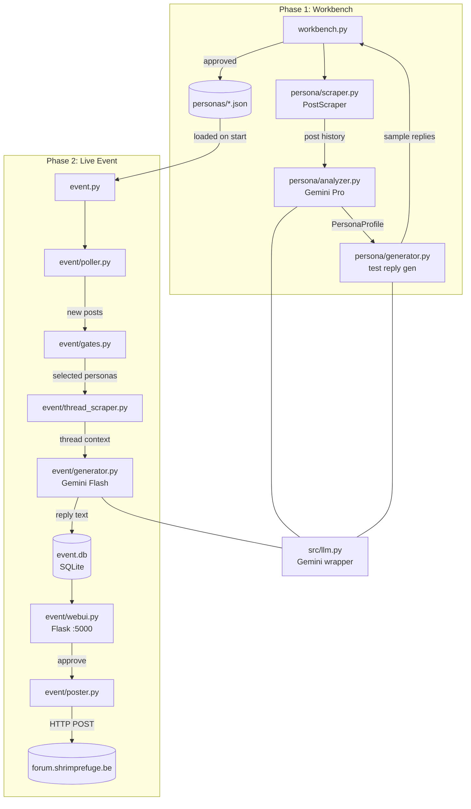
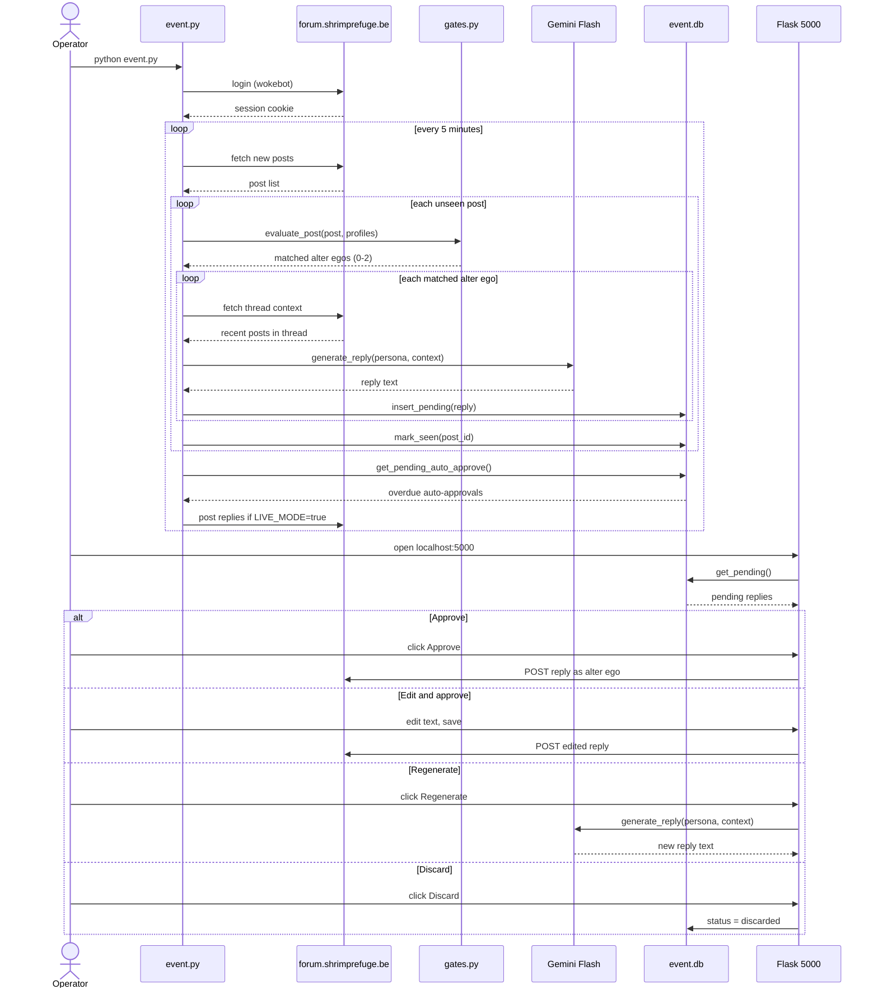
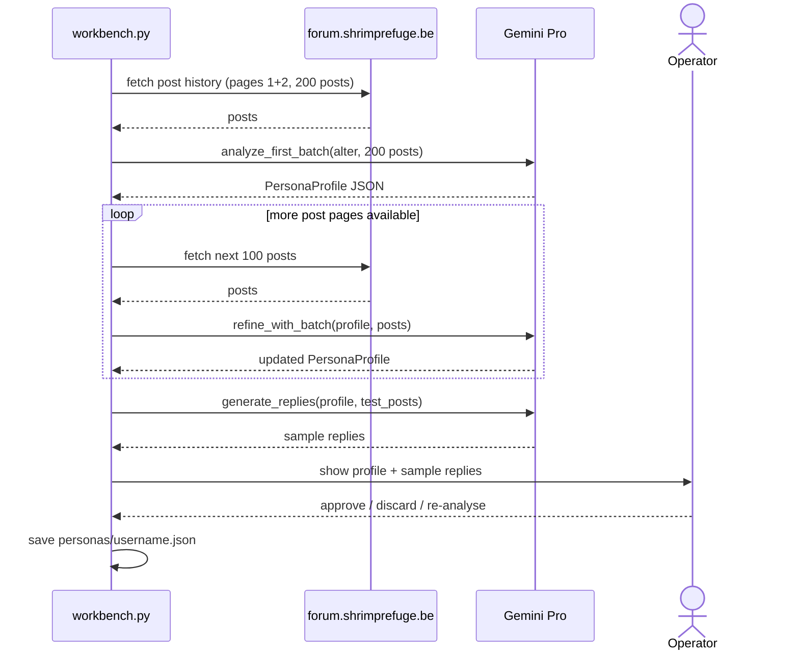

# Shrimp Resurrect

A 24-hour AI experiment on [forum.shrimprefuge.be](https://forum.shrimprefuge.be) — a Dutch-language shrimp-keeping forum built on VBulletin 3.7.

The 26 most historically active members who have been inactive for 2+ years are **resurrected as AI alter egos**. Each alter ego gets a reversed username (e.g. `ShrimpKing` → `gniKpmirS`), a mirror-flipped avatar, and a persona built from their actual post history. During the event they respond live to forum activity — as those members would have.

---

## How it works

The project runs in two phases.

### Phase 1 — Persona Workbench (before the event)

Scrapes each inactive member's post history, feeds it to Gemini Pro, and builds a `PersonaProfile` capturing their writing style, dialect, topic interests, and personality. You review each profile interactively and approve or discard it.

### Phase 2 — Live Event (during the 24h window)

Polls the forum every 5 minutes for new posts. A gate layer decides which alter egos should respond (based on topic relevance, rate limits, and direct mentions). Gemini Flash generates a reply in that persona's voice. The reply lands in a local review queue where you approve, edit, discard, or regenerate it before it goes live.

---

## Architecture



---

## Sequence diagram — live event loop



---

## Workbench sequence — building a persona



---

## Setup

### Prerequisites

- Python 3.11+
- A Google Gemini API key ([Google AI Studio](https://aistudio.google.com/))
- Forum credentials for the scanning account (`wokebot`)
- Separate credentials for each alter ego account (all share one password via `ALTER_PASSWORD`)

### Install

```bash
pip install -r requirements.txt
```

### Configure

Copy `.env.example` to `.env` and fill in the values:

```env
GOOGLE_API_KEY=your_gemini_key
FORUM_USERNAME=wokebot
FORUM_PASSWORD=wokebot123
ALTER_PASSWORD=shared_password_for_alter_egos

# Optional
LIVE_MODE=false          # true = actually post; false = simulate only
LOOKBACK_HOURS=48        # ignore posts older than this on startup
POLL_INTERVAL=300        # seconds between forum polls
SEARCH_DELAY=6           # seconds between post-history requests (forum rate limit)
FORUM_URL=https://forum.shrimprefuge.be
```

---

## Running

### Phase 1 — Build personas

```bash
python workbench.py
```

Processes each account in `config/approved_accounts.json` interactively. Approved personas are saved to `personas/{username}.json`. Re-run as many times as needed — it picks up where it left off.

At the main list, type `b` to run a bulk initial analysis for all unstarted personas automatically.

Inside each persona, the actions are independent:

| Key | Action |
|-----|--------|
| `l` | Load next page (~100 posts) and refine the profile |
| `s` | Generate sample replies on demand |
| `a` | Approve the persona |
| `e` | Edit the raw profile JSON |
| `x` | Reset — delete the profile and restart from scratch |
| `q` | Back to the list |

### Phase 2 — Run the event

```bash
python event.py
```

Opens the review queue at **http://localhost:5000** and starts polling. Set `LIVE_MODE=true` in `.env` when you're ready to actually post replies.

---

## Project layout

```
workbench.py              # Phase 1 entry point
event.py                  # Phase 2 entry point
select_accounts.py        # One-off: selected the 26 inactive members

config/
  approved_accounts.json  # 25 approved alter egos
  test_posts.json         # Test prompts used during persona evaluation

personas/                 # Generated persona profiles (gitignored)
  {username}.json

src/
  llm.py                  # Gemini wrapper (call_llm / call_llm_raw)
  session.py              # VBulletin HTTP session
  models.py               # Shared data models
  persona/                # Phase 1: analysis + reply generation
  workbench/              # Phase 1: interactive TUI
  event/                  # Phase 2: polling, gating, posting, web UI
  scraper/                # Forum scrapers (member list, profiles)
  selection/              # Account selection pipeline

tests/                    # pytest, 84 tests
docs/superpowers/
  specs/                  # Design documents
  plans/                  # Implementation plans
```

---

## Models

| Phase | Task | Model |
|---|---|---|
| Workbench | Persona analysis | `gemini-3.1-pro-preview` |
| Workbench | Sample reply generation (previews) | `gemini-3.5-flash` |
| Live event | Real-time reply generation | `gemini-3.5-flash` |

---

## Gates — who responds to what

A post triggers the gate evaluation for every loaded persona:

1. **Excluded forums** (Discretie, HQ, Forum Games, Donations) — always skip
2. **Direct mention** of the alter ego's username — always enter candidate pool
3. **Topic weight** — each persona has per-forum weights; post must clear 0.20 threshold and pass a weighted random roll
4. **Rate limits** — each persona has hourly and daily caps tracked in SQLite
5. **Max 2 responders** per post — top-weighted candidates win

---

## Tests

```bash
pytest                     # all 84 tests
pytest -v tests/event/     # event layer only
pytest --cov=src           # with coverage
```

`LIVE_MODE` is never set during tests. All LLM calls are patched at the module level — no real API calls are made.
